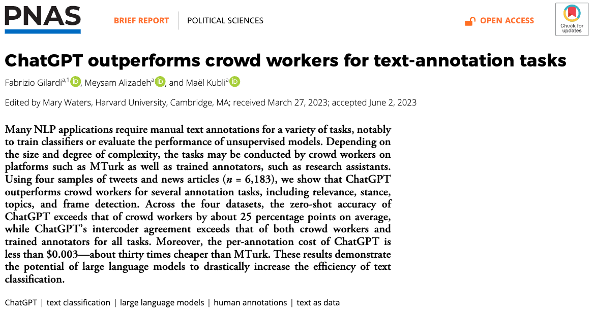

```{r setup, include=FALSE}
knitr::opts_chunk$set(fig.width = 9, fig.height = 3, message = FALSE, warning = FALSE)
```

```{r, include=FALSE}
library(tidyverse)
```

# Background

## Large Language Models

-   Chat partner

-   Consultant: e.g., Financial planning

-   Teacher: e.g., R Programming

-   Counselor

-   Designer

## Large Language Models for Political Data Analytics

What you probably have tried...

-   Proof-reading, copy-editing for papers

-   Debugging for code

-   Inspiring research ideas

\vspace{1cm}

**Today: Document annotation**

**How to extract information you need from documents about using ChatGPT?**

## Document Annotation

Laborious, tedious, BUT ESSENTIAL part of political social data analytics!

What may need annotation for research:

-   Social media posts

-   Newspapers

-   Politicians' pronouncement (e.g., speeches, campaign leaflets)

-   Laws and regulations

-   Historical archives

## Pre-ChatGPT Approaches

-   **Manual annotation**: Hand-code all the documents following rules

-   Machine annotation

    -   Keyword matching

    -   Topic modeling

    -   Dictionary-based sentiment analysis

-   Manual + Machine annotation

    -   Hand-code a portion of documents

    -   Train machine learning models

    -   Use machine learning models to code the remainder of documents

## ChatGPT as Assistant for Manual Annotation

\large

\begin{center}

Instead of hiring human assistants, hire ChatGPT to annotate documents!

\end{center}

\vspace{1cm}

## It has Proven Good Performance

{width="462"}

\footnotesize

Source: <https://www.pnas.org/doi/epdf/10.1073/pnas.2305016120>

## How We Want ChatGPT's Document Annotation Look Like

-   Inputs

    -   Transparent

    -   Interpretable

-   Process

    -   Follow pre-defined rules

    -   Sophisticated

-   Outputs

    -   Structured

    -   Reproducible

## What you need to learn

Getting the input, process, and output right:

-   Figure out what you want ChatGPT to do

-   Give helpful instructions

-   Properly evaluate ChatGPT's performance

# Workflow

## I suggest the following workflow

\small

-   Step 1: Create instructions and a "training" set
    -   Write instructions
    -   Create a "training" annotated set
-   Step 2: Apply ChatGPT to the "training" set
    -   Give ChatGPT the instruction
    -   Use ChatGPT to annotate the "training" set
    -   Clean ChatGPT's outputs
-   Step 3: Evaluate ChatGPT's performance
    -   Examine how well ChatGPT's annotation agrees with the "training" set
    -   If satisfactory, go to Step 4
    -   If not satisfactory:
        -   Investigate cases with disagreement
        -   Modify instructions
        -   Check the "training" set
        -   Go to Step 2
-   Step 4: Apply ChatGPT to annotate documents outside the "training" set.

# Step 1

## To start with...

Before an AI assistant starts working, you should:

-   Know what you want
-   Tell AI precisely what you want

However, AI can help you:

-   Clarify what you want
-   Better articulate what you want

## Example: Content Moderation

Example: Using ChatGPT to label a set of tweets' relevance to "content moderation" (Gilardi et al. 2023)

*"Content moderation" refers to the practice of screening and monitoring content posted by users on social media sites to determine if the content should be published or not, based on specific rules and guidelines."*

We will use the authors' replication materials:

-   Instructions in `data/instructions.txt`

-   A "training" annotated set in `data/training_set.csv`

## Draft Instructions

Write instructions as if you are writing them for a human assistant.

-   Be clear and specific about:

    -   AI's role and tasks

    -   Inputs

    -   Desired outputs

-   Be organized. But do not underestimate AI's ability to understand.

*Ultimately, your instructions should make sense to both humans and AIs.*

## Take a Look at the Example Instructions

\scriptsize

```{r, results='hide', warning=FALSE}
instructions <- readLines("data/input/instructions.txt")
instructions <- str_c(instructions, collapse = "\n")

cat(instructions) # Print the instruction (not shown on slides)
```

\normalsize

Can we improve it? ChatGPT can help!

ChatGPT's graphic user interface suffices (no programming is required).

## Improve Instructions using ChatGPT

{width="474"}

*Excuse me for the grammatical mistake in my prompt. ChatGPT understands it with no problem though.*

## Improve Instructions using ChatGPT

{width="362"}

## Improve Instructions using ChatGPT

{width="364"}

## Finalize the Instructions

I made a few more changes to the instructions. The finalized instructions is saved in `data/instructions_improved_2.txt`.

\scriptsize

```{r, results='hide'}
instructions <- readLines("data/input/instructions_improved_2.txt") |>
  str_c(collapse = "\n")
cat(instructions) # Print the improved instruction, not shown on slides
```

## How Else Can ChatGPT Help with Instructions?

-   Clarify concepts

-   Expand elaborations (e.g., possible scenarios)

You can start with half-cooked instructions and ask ChatGPT to help you build it up. You will be pleasantly surprised how well ChatGPT does.

ChatGPT can inspire, but it cannot replace thinking and decision-making. You should know what you want.

## Other General Templates for Instructions

\small

<https://github.com/iryna-kondr/scikit-llm/blob/main/skllm/prompts/templates.py>

Suggested by Liao Li (PPA, HKU)

## Create a "Training" Set

A straightforward but tedious step

-   Annotate [**a small set of**]{.underline} documents using the instructions you have developed. This can be called a "training" set or a "gold standard" set.

-   Usually, each document should be annotated by two persons.

-   Conflicts between two coders? It happens a lot!

    -   Discard those with disagreement

    -   Discuss and reach an agreement

    -   Give them to a third "tie-breaker"

-   Adjust the instructions based on tricky cases/ disagreement.

## Example: The Gilardi et al. (2023) Training Set

\scriptsize

```{r}
d <- read_csv("data/input/tweets_training.csv", 
              col_types = cols(status_id = col_character()))
# A small text cleaning to replace line breaks with spaces
d <- d |> mutate(text = str_replace_all(text, "(\n|\r)", " "))
```

*Q: How do they deal with conflicts?*

For this in-class demonstration, let's make a smaller "training" set.

```{r}
set.seed(12)
d_train <- d |> 
  select(status_id, text, relevant_ra) |>
  filter(!is.na(relevant_ra)) |>
  sample_n(40) |> 
  arrange(status_id)

table(d_train$relevant_ra)
```

# Step 2

## Step 2: Apply ChatGPT to your "Training" Set

-   Now, it is time to delegate the works to the AI!

-   Do not rush into this step. But there is no need to do too much marginal improvement on instructions and the training set.

-   To discuss:

    -   How to annotate one example document?

    -   How to annotate many documents in batch?

## How to Annotate one document?

First, I will demonstrate how to use ChatGPT to annotate one document.

\scriptsize

```{r, results="asis"}
to_annotate_id <- d_train$status_id[1]
to_annotate_text <- d_train$text[1]
to_annotate_raLabel <- d_train$relevant_ra[1]

cat(to_annotate_id, "\n\n", to_annotate_text, "\n\n", to_annotate_raLabel)
```

## Annotate one Doc: Communicate with the ChatGPT API

\scriptsize

```{r}
# Required packages
library(httr) # Package to communicate with the ChatGPT API
library(jsonlite) # Package to parse results sent by ChatGPT
# TOP SECRET :P My ChatGPT API key. Will expire after class.
api_key <- readLines("data/input/api_key.txt")
api_url <- readLines("data/input/api_url_gpt3.5.txt")
```

```{r, eval=FALSE}
# Make an API call
response <- POST(
  url = api_url, 
  add_headers(`Content-Type` = "application/json", `api-key` = api_key),
  encode = "json",
  body = list(
    temperature = 0, 
    # 0 to 1. How "creative" you want ChatGPT to be. Smaller = less creative.
    messages = list(
      list(role = "system", content = instructions),
      list(role = "user", content = to_annotate_text))
    )
  )
dir.create("data/output_gpt3.5")
write_rds(response, str_c("data/output_gpt3.5/", to_annotate_id, ".rds")) 
# Save ChatGPT's outputs
```

## Annotate one Doc: Interpret ChatGPT's Responses

Now, we can see the outputs returned by ChatGPT

\scriptsize

```{r}
# Load the previously stored results returned from ChatGPT 
response <- read_rds(str_c("data/output_gpt3.5/", to_annotate_id, ".rds"))

# content(response) # This line of code shows the full information returned from the API.

content(response)$choices[[1]]$message$content 
# This only gets you only the content (i.e., ChatGPT's response to your request)

# Compare with RA label
to_annotate_raLabel
```

## Annotate many Doc: Loop through All Documents

\tiny

```{r, eval=FALSE}
# Note: packages have been loaded, and api_key and api_url have been defined.
for (i in 1:5){ # Only loop through 5 for demo purpose
  to_annotate_id <- d_train$status_id[i]
  to_annotate_text <- str_replace_all(d_train$text[i], "(\n|\r)", " ")
  # Above I do a small string operation -- replacing line breaks by spaces
  to_annotate_raLabel <- d_train$relevant_ra[i]
  
  response <- POST(
    url = api_url, 
    add_headers(`Content-Type` = "application/json", `api-key` = api_key),
    encode = "json",
    body = list(
      temperature = 0, 
      # 0 to 1. How "creative" you want ChatGPT to be. Smaller = less creative.
      messages = list(
        list(role = "system", content = instructions),
        list(role = "user", content = to_annotate_text))
      )
    )
  to_annotate_gptLabel <- content(response)$choices[[1]]$message$content
  
  write_rds(response, str_c("data/output_gpt3.5/", to_annotate_id, ".rds")) 
  Sys.sleep(0.5) # Sleep for 0.5 seconds after finishing each doc.
  message(i, " of ", nrow(d_train))
  # Optional below: Print results to get a "live update"
  message("status_id: ", to_annotate_id, "\n", "text: ", to_annotate_text)
  message("Human: ", to_annotate_raLabel, "\t", "ChatGPT: ", to_annotate_gptLabel, "\n")
}
```

## Collect and Clean ChatGPT's responses

\tiny

```{r}
# Get file names of ChatGPT's responses. Note that file names are the status_id
# This helps us identify which file is from which tweet
file_names <- list.files("data/output_gpt3.5")
gpt_labels <- rep(NA, length(file_names))

for (i in seq_along(file_names)){
  response <- read_rds(file.path("data/output_gpt3.5", file_names[i]))
  gpt_labels[i] <- 
    ifelse(
      is.null(content(response)$choices[[1]]$message$content),
      NA, content(response)$choices[[1]]$message$content)
  # The above ifelse() function handles the situation when the output is "content-mderated" by Microsoft!
}

d_gptLabel <- tibble(
  status_id = str_remove(file_names, "\\.rds$"), 
  relevant_gpt = gpt_labels)

d_gptLabel |> print(n = 5)
```

## Merge with the Human-Annotated Data

\scriptsize

```{r}
d_train_merge <- d_train |> inner_join(d_gptLabel, by = "status_id")

d_train_merge |> print(n = 5)
```

# Step 3

## Compare Humans' and ChatGPT's Annotation

Make a Confusion Matrix to compare GPT's and humans' results.

\scriptsize

```{r}
with(d_train_merge, table(relevant_ra, relevant_gpt, useNA = "ifany"))
```

*How good do you think this result is? It agrees with the human annotator in 3/4 of the tasks.*

## How can you improve it?

-   Manually examine the tweets where the human annotator disagree with ChatGPT

-   Think: How can you improve the instructions?

-   Do not rule out the possibility that human annotator make mistakes.

# Step 4

## After you are done with Steps 1-3...

-   You are confident about your instructions

-   Apply the model to documents outside the "training" set.

# GPT 3.5 vs 4

## Does GPT 4 perform better?

\tiny

```{r, eval=FALSE}
api_url_gpt4 <- readLines("data/input/api_url_gpt4.txt")
dir.create("data/output_gpt4")

for (i in 1:5){ # Just do first 5 for demo purpose
  to_annotate_id <- d_train$status_id[i]
  to_annotate_text <- str_replace_all(d_train$text[i], "(\n|\r)", " ")
  to_annotate_raLabel <- d_train$relevant_ra[i]
  
  response <- POST(
    url = api_url_gpt4, 
    add_headers(`Content-Type` = "application/json", `api-key` = api_key),
    encode = "json",
    body = list(
      temperature = 0, 
      messages = list(
        list(role = "system", content = instructions),
        list(role = "user", content = to_annotate_text))
      )
    )
  
  to_annotate_gptLabel <- content(response)$choices[[1]]$message$content
  
  write_rds(response, str_c("data/output_gpt4/", to_annotate_id, ".rds")) 
  Sys.sleep(0.5) # Sleep for 0.5 seconds after finishing each doc.
  message(i, " of ", nrow(d_train))
  # Optional below: Print results to get a "live update"
  message("status_id: ", to_annotate_id, "\n", "text: ", to_annotate_text)
  message("Human: ", to_annotate_raLabel, "\t", "ChatGPT: ", to_annotate_gptLabel, "\n")
}
```

## Collect and Clean GPT-4's responses

\tiny

```{r}
# Get file names of ChatGPT's responses. Note that file names are the status_id
# This helps us identify which file is from which tweet
file_names <- list.files("data/output_gpt4")
gpt_labels <- rep(NA, length(file_names))

for (i in seq_along(file_names)){
  response <- read_rds(file.path("data/output_gpt4", file_names[i]))
  gpt_labels[i] <- 
    ifelse(
      is.null(content(response)$choices[[1]]$message$content),
      NA, content(response)$choices[[1]]$message$content)
  # The above ifelse() function handles the situation when the output is "content-mderated" by Microsoft!
}

d_gptLabel <- tibble(
  status_id = str_remove(file_names, "\\.rds$"), 
  relevant_gpt4 = gpt_labels)

d_gptLabel |> print(n = 5)
```

## Merge GPT-4 Results

\scriptsize

```{r}
d_train_merge_2 <- d_train_merge |> inner_join(d_gptLabel, by = "status_id")
d_train_merge_2 |> print(n = 5)
write_csv(d_train_merge_2, "data/output_clean/labeled.csv")
```

## Evaluate GPT-4 Results

\scriptsize

```{r}
with(d_train_merge_2, table(relevant_ra, relevant_gpt4, useNA = "ifany"))
```

\large

[**100% CORRECT!**]{.underline}

## Takeaway

ChatGPT 4 is much more expensive than GPT 3.5. But it is probably worth the money.

[](https://azure.microsoft.com/en-us/pricing/details/cognitive-services/openai-service/)

Source: [Microsoft Azure](https://azure.microsoft.com/en-us/pricing/details/cognitive-services/openai-service/)

# Final Remarks

## Tips

-   Usually, the most difficult part is figuring out what [**YOU**]{.underline} want the machine to do for you.

-   Test on small samples to avoid unnecessary costs.

-   Be open to being persuaded by the machine. Ask the machine to explain reasons if you are stuck.

## Generalizability of Skills Learned

-   Tools come and go

-   Long live Generative AIs

-   Skills with ChatGPT can be generalizable to other Generative AIs

-   You sacrifice things for simpler operation

    -   Hand over more control to machines (and the companies selling them)

    -   Less interpretability

    -   Less reproducibility

-   If possible, use smaller, open-sourced, and locally-executable models
